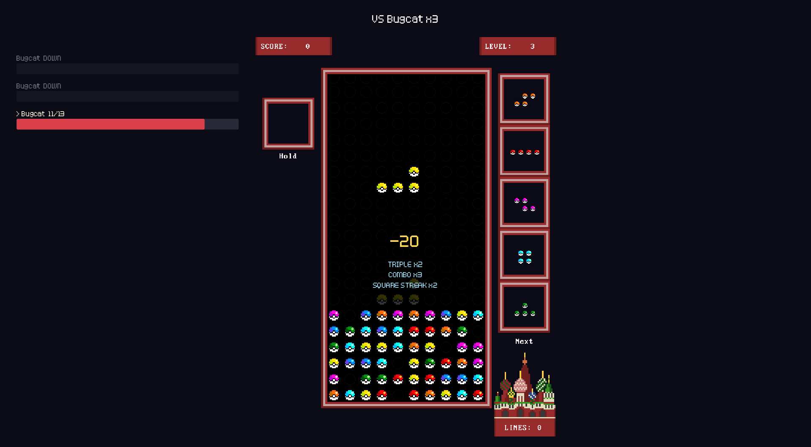

# Tetris combat

Fights in this RPG are resolved by playing Tetris. Clearing lines damages the
enemies; the battle is won when every enemy is defeated and lost if you top out.

Built on [OpenRPG](https://github.com/gdquest-demos/godot-open-rpg) (MIT) and
[PokeTetris](https://github.com/jpcerrone/PokeTetris) (MIT).



## How to run

Open `C:\Godot\godot-open-rpg` in Godot and press F5, or:

```bash
"C:\Godot_v4.5-stable_mono_win64\Godot_v4.5-stable_mono_win64.exe" --path "C:\Godot\godot-open-rpg"
```

## Controls

| Key | Action |
|---|---|
| ← → / A D | Move piece |
| ↓ / S | Soft drop |
| ↑ / W | Hard drop |
| X | Rotate clockwise |
| Z | Rotate anticlockwise |
| Shift | Hold / swap piece |
| Esc | Forfeit the battle (counts as a loss) |

## How damage works

The base rule is **one damage per line cleared**. Everything else is a bonus:

```
damage = ceil((lines + flat_bonuses) * all_multipliers)
```

| Rule | Effect | Label shown |
|---|---|---|
| Line count | 1 line ×1, 2 ×1.5, 3 ×2, 4 ×3 | `DOUBLE` / `TRIPLE` / `TETRIS` |
| Combo | +1 flat damage per clear in an unbroken chain | `COMBO xN` |
| Same-piece streak | 3 clears in a row with the **square** doubles the damage, then restarts | `SQUARE STREAK x2` |
| Back-to-back | Two Tetrises in a row ×1.5 | `BACK-TO-BACK x1.5` |
| Perfect clear | Emptying the board ×5 | `PERFECT CLEAR x5` |

Worked example — a 3-line clear that completes a square streak while 3 clears
into a combo: `(3 lines + 2 combo) × 2 (TRIPLE) × 2 (SQUARE STREAK) = 20`.

A **combo** breaks when a piece locks without clearing. A **same-piece streak**
deliberately does not, so "three clears with the square" doesn't demand three
consecutive pieces.

### Adding a rule

Rules live in `src/combat/tetris_damage_rules.gd`. Each one is a small method
returning a `Contribution` (`flat`, `multiplier`, `label`):

```gdscript
# Clearing from a board that is nearly topped out is worth more.
func _rule_desperation(board_height_ratio: float) -> Contribution:
	var contribution: = Contribution.new()
	if board_height_ratio < 0.8:
		return contribution
	contribution.multiplier = 2.0
	contribution.label = "DESPERATION x2"
	return contribution
```

Then add one line to the rule list in `resolve_clear()`. Streak state lives on
the object and survives the whole battle, so a rule can react to earlier clears.
Anything with a non-empty `label` is shown to the player automatically.

## Enemies

Each enemy in the encounter's `CombatArena` becomes a `TetrisEnemy` with its own
health bar. Damage hits the **first enemy still standing** (marked `>`), and
overkill spills onto the next one, so a big Tetris can drop two weak enemies at
once.

| Enemy stat | Board effect | Rate |
|---|---|---|
| Health | That enemy's battle HP | 1 HP per 4 health |
| Total attack | Garbage rows on the board at the start (one gap each) | 1 row per 5 attack |
| Fastest speed | Starting level (fall speed) | +1 level per 20 speed |

With the stock arenas:

| Arena | Enemies | Battle HP | Garbage | Start level |
|---|---|---|---|---|
| `test_combat_arena.tscn` | Bugcat ×3 | 13 each (39) | 6 | 3 |
| `test_combat_arena2.tscn` | Bugcat, Wolf | 13 + 25 (38) | 4 | 3 |

Tuning: `HEALTH_PER_HP` in `tetris_battle_config.gd` sets fight length globally —
lower it for longer fights.

### Per-arena overrides

Select an arena's root node and use the **Tetris Battle** group in the inspector:

| Property | Default | Meaning |
|---|---|---|
| `tetris_enemy_hp` | `0` | HP for every enemy here. `0` = derive from health |
| `tetris_garbage_rows` | `-1` | Starting garbage. `-1` = derive from attack |
| `tetris_start_level` | `0` | Starting level. `0` = derive from speed |

## Structure

The battle is split so each piece does one job:

```
CombatArena (which enemies)
   └─> TetrisBattleConfig   enemies + starting difficulty
         └─> TetrisBattle   owns the board, applies damage, decides the winner
               ├─ TetrisDamageRules   clear -> damage (combos, streaks)
               ├─ TetrisEnemy         one enemy's health
               └─ UITetrisEnemyList   the health bars
```

| File | Role |
|---|---|
| `src/combat/tetris_damage_rules.gd` | The rule engine. **Add new combo rules here.** |
| `src/combat/tetris_damage_breakdown.gd` | One clear's result: damage + bonus labels |
| `src/combat/tetris_enemy.gd` | An enemy's name and health |
| `src/combat/ui/ui_tetris_enemy_list.gd` | Health bars, target marker, DOWN state |
| `src/combat/tetris_battle_config.gd` | Arena enemies -> battle setup |
| `src/combat/tetris_battle.gd` | Hosts the board, applies damage, damage popups |
| `src/combat/combat.gd` | Branches on `use_tetris_combat`; original JRPG flow kept as `_setup_jrpg_combat()` |
| `scr/Grid.gd` | PokeTetris board. Emits `lines_cleared(count, piece, is_perfect_clear)` and `clearless_lock` |

The board reports *what happened*; it does not decide damage or when the battle
ends (except topping out). That keeps the rules in one place.

### Changes made to PokeTetris

- Added `lines_cleared`, `clearless_lock` and `battle_finished` signals.
- `afterDrop()` captures which piece locked **before** `currentPiece` is reset —
  the square-streak rule depends on it.
- Added `start_level`, `garbage_rows`, `isBoardEmpty()` (perfect clears) and
  `end_battle()`.
- **Replaced two `get_tree().quit()` calls** (top-out and Escape) which would
  otherwise have closed the whole RPG.

## Switching back to JRPG combat

Select the `Combat` node in `src/main.tscn` and untick **Use Tetris Combat**.

## Godot version note

OpenRPG was authored against Godot 4.6.2 and is being run here with Godot 4.5,
which rewrote `config/features` to `"4.5"` and opened it without errors. That
re-save also blanked Dialogic's `dch_directory` / `dtl_directory`, which have
been restored from git.

## Verified

- Every rule unit-tested: base damage, square streak firing on the 3rd clear and
  resetting, a non-square clear breaking the streak, combos, back-to-back
  Tetrises, perfect clear.
- Damage spilling across enemies, and a battle ending when the last one drops.
- End to end in the real game: encounter -> board -> damage -> results dialog ->
  `combat_finished(won)`, for both a win and a loss.
- Windowed 1920×1080 screenshot (above). Boots with zero script errors.

## Not done yet

Enemies are still passive: they have health but never act. Nothing pushes
garbage onto your board mid-fight, there are no status effects, and your party
has no influence on the board. The next step is enemy attacks on a timer driven
by each enemy's speed stat.
